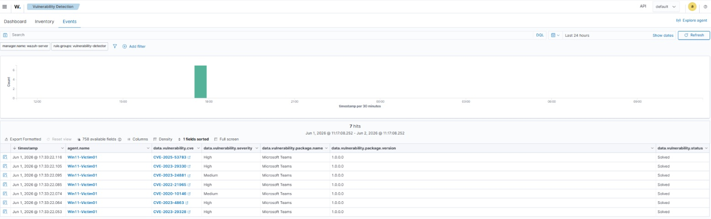
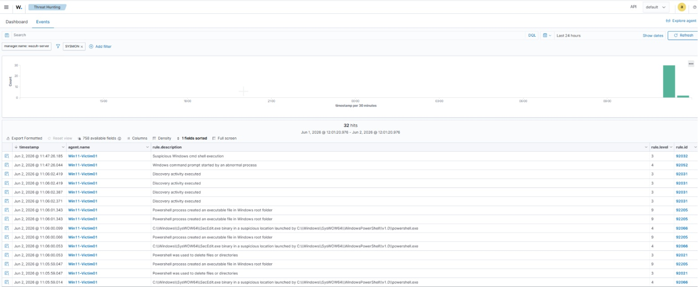
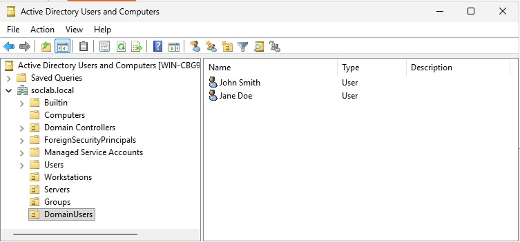

# SOC Lab 2: 5x VMs | Wazuh SIEM | AD Domain Controller | 2 Victims | 1 AttackBox

**Completed:** 2026-06-01
**Author:** Malakh Fuller

> **Privacy note:** Internal lab IP addresses have been anonymized in this writeup and related screenshots. All testing was performed exclusively on my own isolated home lab network.

> **How to read this:** This is the honest version — the wrong turns are in here on purpose. The build that goes perfectly the first time is the build where you didn't learn the thing that actually transfers. Where I assumed something, guessed wrong, or sat staring at a screen not understanding why it was empty, I've left it in, because that friction is the part I can actually defend in an interview.

---

## Objective

For a while, my "lab" was a laptop running Kali sitting next to my desktop, the two of them staring at each other across the desk. It worked — the way a cardboard box works as a fort. Fine for learning the basic moves, useless the moment I wanted to do anything that mattered: run something genuinely hostile, watch it cross a domain, see a SIEM light up the way it would in a real shop. You can't simulate an enterprise with two machines and good intentions.

So the question driving this build was simple, and a little intimidating: could I stand up — from nothing, on a single host — the actual environment a SOC analyst sits inside? Not a toy. A SIEM, an attacker, Windows *and* Linux endpoints, and a real Active Directory domain tying them together, all sealed off from my home network so I could eventually throw malware at it without flinching.

Five VMs, fully isolated, running in VMware Workstation Pro. Going in, I assumed the scary part would be the Domain Controller — Active Directory has a reputation, and I'd only ever read about it. I was wrong about where the difficulty lived. The security tooling mostly behaved. What fought me was the connective tissue: a vendor's download portal, an unchecked box in a network editor, a DNS resolver pointed at the wrong place. That turned out to be the real lesson, and I'll come back to it.

---

## Tools and Technologies

| Category | Details |
|---|---|
| **Hypervisor** | VMware Workstation Pro (Broadcom, free for personal use) |
| **SIEM / XDR** | Wazuh 4.14 (Manager, Indexer, Dashboard) |
| **AttackBox** | Kali Linux 2026.1 |
| **Victim Endpoints** | Windows 11 Enterprise (Evaluation), Ubuntu Server 26.04 LTS |
| **Domain Controller** | Windows Server 2025 (Evaluation) |
| **Endpoint Tools** | Wazuh Agent 4.14.5, Sysmon v15.20 (SwiftOnSecurity config) |
| **Skills Applied** | PowerShell, Linux CLI, Active Directory, Network Segmentation, Log Forwarding |
| **Prior Knowledge** | CompTIA A+, Network+, Security+, CySA+ (in progress), TryHackMe SOC Level 1, prior home SOC lab |

---

## VM Roster

| VM | Role | RAM | vCPU | Disk | IP |
|---|---|---|---|---|---|
| Wazuh-Server | SIEM / XDR | 8GB | 4 | 200GB | 10.10.10.130 |
| Kali-AttackBox | Attack Simulation | 4GB | 2 | 80GB | 10.10.10.128 |
| Win11-Victim01 | Windows Endpoint + Wazuh Agent + Sysmon | 6GB | 2 | 100GB | 10.10.10.131 |
| WinServer-DC01 | Active Directory Domain Controller | 4GB | 2 | 80GB | 10.10.10.134 |
| Ubuntu-Victim02 | Linux Endpoint + Wazuh Agent | 2GB | 2 | 60GB | 10.10.10.133 |

---

## Network Architecture

All five VMs live on an isolated internal network with no path to my real home network. VMnet8 (NAT) only ever existed temporarily, bolted on for the handful of steps that needed internet and pulled off the moment they were done.

| Network | Purpose | Subnet |
|---|---|---|
| VMnet2 | SOC internal — all VMs | 10.10.10.0/24 |
| VMnet8 | NAT (temporary, for downloads only) | 192.168.XX.XX/24 |

The toggle-NAT-on-only-when-you-need-it habit is deliberate. An isolated lab that's quietly reachable from the internet for "convenience" isn't isolated — it's a lab with a back door you forgot about. Easier to make internet the exception than the default.

---

## The Build

### 1. The hardest part was a website

I expected to spend my early friction on Active Directory. Instead I spent it on Broadcom's download portal, which was a genuinely instructive lesson in how *not* to lay out a site.

The first wall was an older page insisting the software was free for only 30 days. That didn't square with what I'd read — Broadcom announced on November 11, 2024 that VMware Workstation Pro would be free for commercial, educational, and personal use, no license key. So something was stale, and I made myself stop and resolve the contradiction instead of just clicking "download" on whatever was in front of me. (Acting on the first source you land on, before checking it against what you already know to be true, is how you end up confidently wrong. Old instinct, new context.)

I created a profile on the Broadcom Support Portal, which *felt* like progress right up until the page told me "No data found." It had dropped me on the **My Entitlements** page — empty, because I hadn't purchased anything. The actual download was buried under **My Downloads → All Products**; I searched "VMware Workstation Pro" and found it at the bottom of a long list. Agreed to the terms, and a 274MB installer finally appeared. Clean install from there.

Annoying, but worth keeping in the writeup, because "the tool is free and easy; *finding* the tool is the obstacle" is a pattern that repeats constantly in this field.

### 2. Drawing the network before the machines

Before I built a single VM, I built the network they'd sit on. Standing up machines first and trying to re-plumb them onto isolated segments later is exactly the kind of shortcut that costs you an evening, so I did the boring foundational thing first.

In **Edit → Virtual Network Editor** I created two custom networks:

| Network | Purpose | Subnet |
|---|---|---|
| VMnet2 | SOC internal (all VMs) | 10.10.10.0/24 |
| VMnet3 | Originally planned for Kali isolation | 10.10.20.0/24 |

Then the first real head-scratcher: neither VMnet2 nor VMnet3 showed up in the VM's network-adapter dropdown, even though I'd just created them. They existed on paper and were invisible to the machines that needed them. The fix wasn't documented anywhere obvious — I had to find it by poking: each custom network needs **"Connect a host virtual adapter to this network"** checked. Tick that, apply, and both appeared instantly. In hindsight it's logical; from the UI it was not. This one bit me hard enough that it stuck, and it shows up again the next time I build a lab.

I'd originally planned to drop Kali on VMnet3 to simulate an attacker crossing a segment boundary. I talked myself out of it for this phase and put everything on VMnet2. Real attackers don't always arrive from a tidy separate segment, and what I actually cared about was whether Wazuh would *see* the traffic and alert on it — not which virtual switch Kali happened to be plugged into. Knowing which complexity to skip is its own skill; I'd rather earn the segmentation lesson deliberately later than carry it as dead weight now.

| VM | Network |
|---|---|
| Kali-AttackBox | VMnet2 |
| Wazuh-Server | VMnet2 |
| Win11-Victim01 | VMnet2 |
| WinServer-DC01 | VMnet2 |
| Ubuntu-Victim02 | VMnet2 |

### 3. Kali, the easy one

Every build needs one part that just works, and this was it. From `https://www.kali.org/get-kali/#kali-virtual-machines` I grabbed the prebuilt VMware image as a `.7z`, extracted it to `C:\VMs\Kali-AttackBox\`, opened the `.vmx` directly, set it to 4GB / 2 cores / VMnet2, and powered on.

Kali booted straight to the desktop. `ip a` confirmed it had picked up `10.10.10.128` on the right subnet — the first proof the network plumbing from step 2 actually worked — and I took a snapshot, **"Fresh Install - Clean."** (Snapshot, label it, move on. Every clean state I can roll back to is an hour I don't lose later.) Default creds on the prebuilt image are `kali` / `kali`.

### 4. The SIEM — and a password that wouldn't take

The Wazuh server runs on Ubuntu Server 26.04 LTS, pulled from `https://ubuntu.com/download/server`, in a heavier VM: 8GB / 4 cores / 200GB / VMnet2.

The install was mostly uneventful, with one moment that made me second-guess myself: the network screen only offered "Continue without network," which felt like a problem. It wasn't. The VM had already grabbed `10.10.10.130` over DHCP — the installer was just being cautious. I continued without network and it finished fine. Build choices worth recording: full disk, LVM, no encryption; user `malakh`, hostname `wazuh-server`; OpenSSH installed; Ubuntu Pro skipped.

After the reboot I added a second adapter on NAT (VMnet8) to give the box temporary internet for the Wazuh install, and confirmed both interfaces were up before trusting either:

- `ens33` — 10.10.10.130 (VMnet2, lab network)
- `ens37` — 192.168.XX.XX (VMnet8, NAT/internet)

Then `ping -c 3 google.com` to verify the box could actually reach out.

> **Note on `ping -c 3`:** the `-c 3` caps it at three packets instead of pinging forever. Without it you're hitting Ctrl+C to stop a thing that should have stopped itself. Small habit, but it's the kind of small habit that compounds.

For the install command itself I went to the official Wazuh Quickstart (`https://documentation.wazuh.com/current/quickstart.html`) rather than a blog post — a rule I was actively trying to make automatic. These scripts run as root; *where the command comes from* matters as much as what it does. Same instinct as never acting on a source you haven't vetted.

```bash
curl -sO https://packages.wazuh.com/4.14/wazuh-install.sh
sudo bash wazuh-install.sh -a
```

One gotcha baked into that URL: the path pins the version (`4.14`). An earlier try with the generic `4.x` came back Access Denied from the CDN — the catch-all path no longer resolves.

About fifteen minutes later it had stood up the Manager, Indexer, and Dashboard on the one host, and printed the admin credentials. I saved those immediately, and also pulled them straight from the install files so I had a second copy:

```bash
sudo tar -O -xvf wazuh-install-files.tar wazuh-install-files/wazuh-passwords.txt
```

Then the part that ate real time: the generated password didn't work on first login. Best guess is a copy/paste encoding hiccup — the kind of silent character-mangling that makes you doubt your own typing. Rather than fight it, I reset it cleanly with the password tool:

```bash
sudo /usr/share/wazuh-indexer/plugins/opensearch-security/tools/wazuh-passwords-tool.sh -u admin -p SOClab2026-Lab
```

After that, `https://10.10.10.130` logged in without argument. Pulled the NAT adapter, snapshot **"Wazuh Installed - Clean."**

### 5. The first endpoint, and the moment my own hands looked like an attacker

This is the section where the lab stopped being plumbing and started being a SOC.

**Standing up Win11.** Microsoft hands out 90-day evaluation copies of Windows 11 Enterprise, which is exactly what a fake corporate endpoint wants. Downloaded from `https://www.microsoft.com/en-us/evalcenter/evaluate-windows-11-enterprise`. There were two flavors — regular and LTSC — and I picked regular on purpose: LTSC is the stripped-down build for ATMs and medical gear, not the standard corporate desktop I was trying to imitate. VM: 6GB / 2 cores / 100GB / VMnet2.

Two small first-contact snags. At the Boot Manager, "Boot normally" just looped back to the same screen — obvious in hindsight, since there was no OS installed yet; the right pick was **"EFI VMware Virtual SATA CDROM Drive"** to boot the ISO. And during setup, choosing "I don't have internet" was the move that let me skip the forced Microsoft account and make a local one instead. Privacy toggles all off (no telemetry from a lab), user `Victim01`, snapshot **"Win11 Fresh Install - Clean."**

I installed VMware Tools next (**VM → Install VMware Tools**, then `setup.exe` off the virtual CD, Typical, reboot) — partly for performance, mostly because it enables the shared folders I'd need to move Sysmon onto an air-gapped VM later.

**The Wazuh agent.** Temporary NAT adapter on, both IPs confirmed (`10.10.10.131` on VMnet2, NAT on the other), then I opened the dashboard from inside the VM and walked **Deploy New Agent → Windows → MSI 32/64 bits**, server `10.10.10.130`, name `Win11-Victim01`. The dashboard generated a PowerShell one-liner; I ran it as Administrator, it pulled the MSI from Wazuh's servers and registered the agent on its own, and:

```powershell
NET START WazuhSvc
```

The agent showed **Active** in the dashboard immediately — and then did something that genuinely impressed me with zero input from me: it started reporting vulnerabilities. Within minutes, seven CVEs flagged against Microsoft Teams, several rated High. That's real threat intelligence the moment an endpoint checks in, no configuration on my part.


*Wazuh's Vulnerability Detection view — seven CVEs surfaced on Win11-Victim01 against Microsoft Teams within minutes of the agent connecting, several rated High. The endpoint reports its own posture the instant it joins; the SIEM correlates it automatically.*

Pulled the NAT adapter, snapshot **"Wazuh Agent Installed - Clean."**

**Sysmon, and the false-positive flood.** Sysmon is the Windows service that logs the granular stuff — process creation, network connections, file writes — into the event log. Without it your endpoint visibility is shallow; with it you get the telemetry that makes detection actually possible. Here's the WHY before the how: the Wazuh agent ships standard Windows logs out of the box, but Sysmon writes to its *own* dedicated channel that nothing collects unless you tell it to.

Since the NAT adapter was gone, I couldn't download to the VM directly, so I pulled two files to the host instead:

- **Sysmon** (Sysinternals): `https://download.sysinternals.com/files/Sysmon.zip`
- **SwiftOnSecurity config**: `https://raw.githubusercontent.com/SwiftOnSecurity/sysmon-config/master/sysmonconfig-export.xml`

The SwiftOnSecurity config is the well-worn community baseline — a sane starting point that covers the events that matter, before I start writing my own rules. I moved both over a VMware Shared Folder (**VM → Settings → Options → Shared Folders**), then, in PowerShell as Administrator:

```powershell
cd "\\vmware-host\Shared Folders\VMShare"
.\Sysmon64.exe -accepteula -i sysmonconfig.xml
```

Output confirmed config validated, Sysmon64 installed, SysmonDrv installed, Sysmon64 started. But installing Sysmon only gets the data *into* the Windows event log — I still had to tell the Wazuh agent to read that channel and forward it:

```powershell
notepad "C:\Program Files (x86)\ossec-agent\ossec.conf"
```

added to the `<localfile>` section:

```xml
<localfile>
  <location>Microsoft-Windows-Sysmon/Operational</location>
  <log_format>eventchannel</log_format>
</localfile>
```

and restarted the agent so it would actually load the change (editing a config and reloading the service that reads it are two separate acts — a lesson that would cost me dearly in a later build):

```powershell
NET STOP WazuhSvc
NET START WazuhSvc
```

In the dashboard's **Threat Hunting** view, filtered to `rule.groups: sysmon`, events poured in instantly — and every single one was *me*:

- *"Suspicious Windows cmd shell execution"*
- *"Windows command prompt started by an abnormal process"*
- *"PowerShell process created an executable file in Windows root folder"*
- *"PowerShell was used to delete files or directories"*
- *"SecEdit.exe binary in a suspicious location launched by PowerShell"*


*Threat Hunting filtered to `rule.groups: sysmon` — 32 hits, every one of them generated by my own setup work: cmd and PowerShell execution, SecEdit.exe launched from a suspicious location, file deletion. Textbook false positives, and the whole reason alert tuning exists.*

This was my first hands-on encounter with **false positives**, and it landed harder than reading about them ever did. My own legitimate admin activity was indistinguishable, to the SIEM, from an attack. When I eventually run real attacks from Kali, the *same* alerts will fire — except then they'll be true positives. The entire job sits in that gap: the data looks identical, and the analyst's work is deciding which is which.

That is the most direct line from my old work to this one. Source evaluation is exactly this problem — a stream of plausible-looking signal, most of it benign, and the discipline to tell the rare real thing from the noise that resembles it. The tooling is new. The judgment is not. Snapshot **"Wazuh Agent + Sysmon Installed - Clean."**

### 6. The Linux endpoint — quick, this time

By now the Ubuntu Server install felt routine, which is its own small reward. New VM at 2GB / 2 cores / 60GB / VMnet2, same ISO as before. It came up clean and grabbed `10.10.10.133` on VMnet2; OpenSSH in, Ubuntu Pro skipped, login prompt in short order.

The agent install is genuinely pleasant on Linux — one chained command, NAT adapter on, `ping -c 3 google.com` to confirm reachability first:

```bash
wget https://packages.wazuh.com/4.x/apt/pool/main/w/wazuh-agent/wazuh-agent_4.14.5-1_amd64.deb \
  && sudo WAZUH_MANAGER='10.10.10.130' WAZUH_AGENT_NAME='Ubuntu-Victim02' \
  dpkg -i ./wazuh-agent_4.14.5-1_amd64.deb
```

then bring it up and make it survive a reboot:

```bash
sudo systemctl daemon-reload
sudo systemctl enable wazuh-agent
sudo systemctl start wazuh-agent
sudo systemctl status wazuh-agent
```

`active (running)`, and Ubuntu-Victim02 landed in the dashboard as the second live agent. NAT off, snapshot.

### 7. The Domain Controller — the part I dreaded

Here's the irony I flagged up top: this is the section I walked into nervous about, and it's the one that mostly cooperated. The friction it *did* throw was concentrated in two spots — a blank password, and DNS — and both were exactly the kind of foundational thing that's easy to overlook and impossible to skip.

**Windows Server, the cautious choice.** Microsoft's 180-day Server evals come from `https://www.microsoft.com/en-us/evalcenter/evaluate-windows-server-2025`. I took **Server 2025 Standard**, not Datacenter — Datacenter is for big shops with unlimited-virtualization needs and is overkill for a lab. 4GB / 2 cores / 80GB / VMnet2, clean install, snapshot **"Fresh Install - Clean."**

The Wazuh agent went on the same way as Win11 — NAT, dashboard, deploy a new agent named `WinServer-DC01`, run the generated PowerShell, `NET START WazuhSvc`. That brought the fleet to three live agents, which felt like a milestone worth a screenshot.


*The Wazuh Agents view — all three endpoints (Win11-Victim01, Ubuntu-Victim02, WinServer-DC01) reporting `active` on agent v4.14.5. The full fleet, checked in and reporting to one SIEM.*

NAT off, then Sysmon by the now-familiar path (shared folder, `Sysmon64.exe -accepteula -i sysmonconfig.xml`), snapshot **"Wazuh Agent + Sysmon Installed - Clean."**

**What AD DS actually is, before I touched it.** Right now WinServer-DC01 was a standalone box that knew about itself and nothing else. Installing the AD DS role turns it into a *directory service* — a central database of every object on the network (users, computers, groups, policies) — and promoting it to Domain Controller makes it the authority every other machine authenticates through. Understanding that *before* clicking through the wizard mattered: it's the difference between following steps and knowing what the steps are for. **Server Manager → Add Roles and Features → Role-based installation → Active Directory Domain Services → Add Features → Install**, "Restart automatically if required" checked.

**Promotion, and the blank-password block.** Afterward, the yellow flag in Server Manager offered "Promote this server to a domain controller." I chose **Add a new forest** — first DC, brand-new domain structure. A forest was new vocabulary to me, so, plainly:

```
Forest
  └── Tree
        └── Domain
              └── Organizational Units (OUs)
                    └── Users, Computers, Groups
```

The forest is the outermost boundary; the whole AD environment lives inside it. I built a single forest with a single domain, `soclab.local` — the common small-shop layout.

The prereq check then failed for a reason I respected: the local Administrator account had a blank password, and AD flatly refused to stand up a domain on an unsecured admin account. That's the OS enforcing a security floor I should have set myself, and it's a good reminder that "it let me proceed" is not the same as "it was safe." Fixed in PowerShell:

```powershell
net user Administrator [strong-password]
```

Re-ran the check, hit Install, and the server promoted and rebooted with **AD DS** and **DNS** now live as roles. Snapshot **"DC Promotion Complete - Clean."**

**Structure and users.** In **Tools → Active Directory Users and Computers**, I right-clicked `soclab.local` and built four OUs: `Workstations`, `Servers`, `DomainUsers` (I wanted `Users`, but that name's already claimed by a default system container — a small naming collision worth knowing about), and `Groups`. Two test users went into `DomainUsers`:

| Name | Username |
|---|---|
| John Smith | jsmith |
| Jane Doe | jdoe |

Both with "Password never expires" set and "must change at next logon" unchecked — fine for a lab, the opposite of what you'd do in production. Then a `SOC-Lab-Users` security group in `Groups`, with jsmith and jdoe added as members.


*Active Directory Users and Computers on WinServer-DC01 — the `soclab.local` tree with the custom OUs (Workstations, Servers, Groups, DomainUsers) alongside the default containers, and the two test users, John Smith and Jane Doe, sitting in DomainUsers.*

Snapshot **"AD Structure Complete - Users and OUs Created."**

**Joining Win11 — DNS first.** A machine finds its domain through DNS, so before anything else I pointed Win11-Victim01's resolver at the DC. This is Net+ knowledge I had cold on paper and was now wiring up for real:

```powershell
netsh interface ip set dns "Ethernet0" static 10.10.10.134
nslookup soclab.local
```

`nslookup` resolved correctly, which was the green light, then:

```powershell
Add-Computer -DomainName soclab.local -Credential SOCLAB\Administrator -Restart
```

and after the reboot I *verified* rather than assumed:

```powershell
systeminfo | findstr /B /C:"Domain"
```

`Domain: soclab.local`. Agents still active, snapshot **"Joined soclab.local Domain - Clean."**

**Joining Ubuntu — the beat that taught me the most.** I didn't fully appreciate, before this, that a Linux box could join a Windows domain at all. It can, but not out of the box — it needs a package stack first. NAT on, then:

```bash
sudo apt update && sudo apt install -y realmd sssd sssd-tools adcli packagekit samba-common-bin oddjob oddjob-mkhomedir
```

What the load-bearing pieces do:
- **realmd** — discovers and joins AD domains
- **sssd** — handles AD authentication on Linux
- **adcli** — the AD command-line interface
- **samba-common-bin** — Samba utilities for Windows/Linux interop

Then I tried to discover the domain and hit the wall that made this section memorable:

```bash
sudo realm discover soclab.local
```

**"No such realm found."** And here's where the verify-the-foundation habit paid off instead of sending me down a rabbit hole: the symptom screamed "domain problem," but the actual fault was one layer down. Ubuntu's resolver still wasn't pointed at the DC, so the discovery had no way to *find* anything to discover. Same lesson the Win11 join had just taught, in a different accent — in a mixed-OS environment, DNS is the floor everything else stands on. Fixed it:

```bash
sudo nano /etc/resolv.conf
# nameserver -> 10.10.10.134
```

`sudo realm discover soclab.local` now returned the full domain, and the join went clean:

```bash
sudo realm join -U Administrator soclab.local
```

`realm list` confirmed it:

```
soclab.local
  configured: kerberos-member
  domain-name: soclab.local
  login-formats: %U@soclab.local
  login-policy: allow-realm-logins
```

Both endpoints showed up in the `Computers` container on the DC. NAT off, snapshot **"Joined soclab.local Domain - Clean."**

---

## Final Lab State

| VM | IP | Role | Domain Member | Wazuh Agent | Sysmon |
|---|---|---|---|---|---|
| Kali-AttackBox | 10.10.10.128 | Attacker | No | No | No |
| Wazuh-Server | 10.10.10.130 | SIEM / XDR | No | No | No |
| Win11-Victim01 | 10.10.10.131 | Windows Endpoint | Yes (soclab.local) | Yes | Yes |
| Ubuntu-Victim02 | 10.10.10.133 | Linux Endpoint | Yes (soclab.local) | Yes | No |
| WinServer-DC01 | 10.10.10.134 | Domain Controller | Yes (soclab.local) | Yes | Yes |

The laptop-glaring-at-the-desktop is gone. In its place: five machines on an isolated segment, three of them reporting endpoint and Sysmon telemetry to a SIEM, two of them joined to a domain run by a controller I promoted by hand — the environment a SOC analyst actually works inside, instead of two computers staring each other down.

---

## Key Lessons (the transferable kind)

These are the ones I'll carry forward, because each cost me something to learn.

1. **The boring infrastructure is the hard part.** I braced for Active Directory and got ambushed by a download portal and an unchecked box. The marquee security tools mostly behave; the plumbing, permissions, and DNS around them are where the time goes — which, conveniently, is also where things break at 2am in a real SOC.
2. **Custom VMnets are invisible until you connect a host adapter.** Networks created in the Virtual Network Editor don't appear in the VM dropdown until "Connect a host virtual adapter to this network" is checked. Documented nowhere obvious; found by troubleshooting.
3. **Wazuh starts earning its keep the instant an agent connects.** Seven CVEs against Microsoft Teams surfaced on Win11 within minutes, several High, zero configuration. Agent-based coverage means an endpoint reports its own posture the moment it checks in.
4. **Your own hands look exactly like an attacker's.** Every Sysmon alert in the first pass was my legitimate setup activity. False positives aren't an edge case — they're the default, and telling them from true positives is the actual job, not a footnote to it.
5. **In a mixed-OS environment, DNS is the foundation.** The Linux domain join failed with "No such realm found" until I pointed the resolver at the DC. The symptom looked like a domain problem; the fault was one layer below it. Check the floor before you blame the walls.
6. **Source matters for install commands.** Get them from official project documentation, not blog posts. These scripts run as root — *where the command came from* is part of its trustworthiness. Same instinct as vetting a source before acting on it.
7. **"It let me proceed" is not "it was safe."** AD refused to promote on a blank Administrator password — the OS enforcing a floor I should have set myself. Worth internalizing as a habit rather than waiting to be told.

---

## Key Competencies Demonstrated

- Multi-VM hypervisor configuration (VMware Workstation Pro)
- Isolated network segmentation using custom VMnets
- SIEM deployment and configuration (Wazuh 4.14 — Manager, Indexer, Dashboard)
- Wazuh agent deployment on Windows and Linux endpoints
- Sysmon installation and configuration using community best-practice ruleset
- Log collection and forwarding configuration (ossec.conf)
- Active Directory domain deployment (AD DS role, forest creation, OU structure)
- Domain joining of both Windows and Linux endpoints
- Basic alert triage — identifying false positives from admin activity
- Snapshot management and systematic documentation throughout

---

## Employer-Relevant Skills

**Tools:** Wazuh, Sysmon, VMware Workstation Pro, PowerShell, Linux CLI (Ubuntu), Active Directory Users and Computers, Windows Server Manager

**Concepts:** SIEM architecture, endpoint instrumentation, agent-based log collection, network segmentation, vulnerability detection, Active Directory administration, false positive identification

**Frameworks:** MITRE ATT&CK (referenced for Phase 2 attack simulation planning)

---

## SOC Relevance

This is the environment a Tier 1 or Tier 2 analyst lives in at an MSSP or an enterprise security team: a SIEM taking telemetry from instrumented endpoints across a domain. That core shape is the foundation under almost every SOC engagement.

And the hands-on parts are the parts that transfer most directly — configuring log collection, watching alerts fire in real time, and separating routine admin noise from something that actually warrants a second look. When I sat in front of a Threat Hunting view full of my own activity dressed up as suspicious behavior, I was doing a small version of exactly what day-one SOC work is. Knowing how the data gets from endpoint to SIEM, and why some events trip alerts while others don't, is what makes triage faster and less guessy. I built every hop, so I know where each one runs.

---

## HUMINT to SOC Translation

Two decades of source work left me with a few instincts that turned out to be the most useful tools in this build, and none of them are technical.

The first is verifying the foundation before trusting anything built on it. It showed up when I refused to accept the stale "30-day" download page over what I knew to be true, when I pulled the Wazuh command from official docs instead of a blog, and most clearly when "No such realm found" turned out to be a DNS problem one layer beneath the symptom. The discipline is the same as vetting a source before you act on what it tells you — the cost of skipping it is being confidently wrong.

The second is the signal-versus-noise problem, which *is* the false-positive lesson. A SIEM hands you a stream of plausible-looking activity, the overwhelming majority of it benign, and asks you to find the rare real thing inside it. That's source evaluation with different nouns. The careful read isn't in any single alert; it's in knowing what normal looks like well enough to feel the thing that isn't.

And the third is just working a problem methodically when the documentation runs out — the VMnet dropdown, the password that wouldn't take, the resolver pointed at nothing. The tooling here is new to my hands. The way of thinking is not, and it's the part that doesn't print on a certificate.

---

## What's Next

My earlier dual-machine lab covered the foundational ground — basic recon detection, failed-login investigation, suspicious-PowerShell hunting with Sysmon, phishing triage, and one end-to-end recon-to-detection run. With five VMs and a real Active Directory domain now standing, the next phase goes after the attacks that domain makes possible:

- **Project 1:** Credential attack against Active Directory — password spray (MITRE T1110.003)
- **Project 2:** Kerberoasting — Event ID 4769 detection (MITRE T1558.003)
- **Project 3:** Lateral movement detection
- **Project 4:** Custom detection rule writing
- **Project 5:** Full purple-team exercise — end-to-end attack chain with a complete incident report

That's where this stops being an environment I stood up and becomes one I can defend, attack by attack, detection by detection.

---

## Author

[Malakh Fuller](https://www.linkedin.com/in/malakhfuller/)
